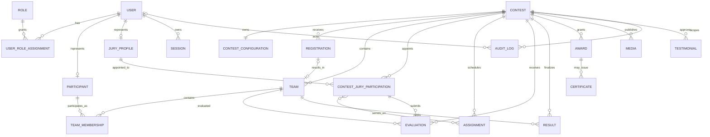

# Kaizen Data Model V1 — Finalized Proposed Domain Model

**Phase:** 0.2A — documentation only. This document makes no schema, API, MongoDB, authentication, authorization, or frontend change.

## 1. Purpose

Kaizen V1 manages contests, teams, juries, assignments, and evaluations. The future platform must support reusable participant identities, registrations, contest-specific configuration, multi-year history, awards, certificates, and content without mixing one contest with another.

The historical requirement is absolute: an old contest must remain intelligible on its original terms. A 2026 contest must still show its 2026 categories, criteria, team rules, schedule, scoring, results, and awards after 2027 introduces different versions.

## 2. Current MongoDB Baseline

`backend/src/db.js` uses MongoDB. Most logical tables are one wrapper document whose `data` holds a whole array or object; `activity_logs` has one document per event.

| Current collection | Actual structure used in code | Scope / principal limitation |
|---|---|---|
| `admins` | Wrapper array of records with `id`, `username`, `password`, `access`, `isDeleted`, timestamps, and session fields. | Platform-wide; excluded from snapshots. |
| `contests` | Wrapper array: `id`, `name`, `code`, dates, `days`, halls, `status`, `published`, `allowScoreUpdates`, timestamps. | Parent scope, but criteria/categories are not stored here. |
| `juries` | Wrapper array with identity/login, role, deletion, password-change, and session fields. | Global jury records, not contest appointments. |
| `teams` | Wrapper array with `contestId`, code/name, organization, category, day/hall, deletion, timestamps. | Contest-scoped; no members/participants. |
| `hall_assignments` | Wrapper array with `contestId`, day, hall, two `juryIds`, timestamps. | Contest-scoped; references global juries. |
| `evaluations` | Wrapper object: `teamId → juryId → { scores, total, submittedAt, submittedBy, createdAt? }`. | Contest is inferred through a team; no criteria/configuration snapshot. |
| `state` | Global object containing `activeContestId`, `sessionVersion`, and legacy initialization data. | Not a contest lifecycle model. |
| `activity_logs` | Individual actor/action/entity/detail/timestamp documents. | Audit-like, but contest scope is inconsistent. |

Current frontend constants provide categories and criteria at runtime. They are not MongoDB historical truth. Teams and assignments carry `contestId`; evaluations do not persist it directly. Deleting teams/juries can remove evaluations.

## 3. Finalized Domain Model

**Approved decision: Participants are reusable platform identities across contests.**

`User`, `Participant`, `Registration`, `Team`, and `Team Membership` are distinct:

- **User:** a platform identity capable of authentication.
- **Participant:** a reusable person profile, optionally linked to a user.
- **Registration:** an entry/review workflow for one contest.
- **Team:** one contest-specific competing unit.
- **Team Membership:** a participant's role in one team for one contest.

Use independent MongoDB documents when an entity requires independent querying, indexing, lifecycle, growth, authorization, or history. Embed bounded data that is owned and normally read/written with one aggregate.

## 4. Entity Definitions

| Entity | Purpose / ownership | Storage decision | Scope, relationships, history, lifecycle, deletion |
|---|---|---|---|
| **User** | Authentication identity; owns credentials, account status, sessions. | **Collection.** Spans roles and contests. | Platform-wide; relates to roles, optional participant/jury profiles, sessions. Deactivate, do not erase activity-linked accounts. |
| **Role** | Broad responsibility: `SUPER_ADMIN`, `ADMIN`, `CONTEST_SUPERVISOR`, `JURY`, `PARTICIPANT`. | Controlled definitions may be application-managed; role assignments may be embedded for simple cases or a collection when scoped/history-bearing. | Definitions are platform-wide; assignments may be platform or contest scoped. RBAC is conceptual only. Retire rather than delete historic assignments. |
| **Participant** | Reusable person profile, independent of contest. | **Collection.** Searchable/reusable across teams and years. | Platform-wide; may link to `userId`, memberships, registrations. Profile edits must not rewrite historical membership snapshots. Deactivate/anonymize by policy. |
| **Jury Profile** | Reusable person eligible to evaluate. | Link to User; use a `jury_profiles` collection only for material jury-specific fields. | Platform-wide; links to contest jury participation. Deactivate future eligibility, retain past activity. |
| **Contest** | One Kaizen event; aggregate root. | **Collection.** Has lifecycle, archive, and many dependents. | Parent of all contest operations/content. Archive after operational use; never hard-delete finalized history. |
| **Contest Configuration** | Categories, criteria, weights, scoring, registration/team/award rules, settings. | **Embedded versioned subdocument on Contest** while bounded and owned by the contest. | Contest-scoped. Freeze effective version at finalization; do not overwrite historical versions. |
| **Registration** | Attempt/entry to participate, distinct from the resulting team. | **Collection.** Independent workflow/review queue. | Requires `contestId`; may link applicant participant(s), organization, and resulting team. Lifecycle: `DRAFT`, `SUBMITTED`, `UNDER_REVIEW`, `APPROVED`, `REJECTED`, `WITHDRAWN`. Retain decisions. |
| **Team** | Contest-specific competitive unit. | **Collection.** Needs schedule, evaluation, result, award, and export queries. | Requires immutable `contestId`; may reference registration. Owns display snapshots, relates to memberships. Withdraw/deactivate rather than delete after history exists. |
| **Team Membership** | Participant's role in one team, e.g. leader/member. | **Collection.** Reusable participants require historical roles and independent queries. | Requires `contestId`, `teamId`, `participantId`; optional registration. Preserve role/name snapshot at approval/finalization; end membership instead of deleting history. |
| **Contest Jury Participation** | Appointment of a reusable jury profile to one contest. | **Collection.** Availability/status varies by contest. | Requires `contestId` and jury profile/user reference; links to assignments/evaluations. Deactivate future work without removing history. |
| **Assignment** | Allocation to contest/day/hall or evaluation location. | **Collection.** Needs uniqueness, schedules, revisions, queries. | Requires `contestId`, schedule slot, jury participation IDs. Supersede/version after evaluations begin. |
| **Evaluation** | Jury score for one team using one contest configuration. | **Collection.** Needs uniqueness and queries; embed bounded scores/criterion snapshot. | Requires `contestId`, team, jury participation, optional assignment, config version. Preserve scores, totals, status, timestamps. Void/revise with reason, not destructive overwrite. |
| **Result** | Finalized rank/scoring outcome. | **Collection.** Requires publication, exports, versions, history. | Requires `contestId`, team, calculation/configuration version. Finalized records are immutable except audited supersession. |
| **Award** | Contest award definition/grant. | **Collection.** Has recipients, approval, publication/revocation. | Requires `contestId`; relates to results/recipients. Preserve grants in archives. |
| **Certificate** | Issued contest artifact. | **Collection.** Has serial, template/version, issuance/reissue/revocation and file reference. | Requires `contestId` and recipient; never delete issued history, revoke/supersede. |
| **Media** | Contest photographs, video, banners, images. | **Collection for metadata**; binary belongs in object storage. | Normally requires `contestId`; may relate to team/result/award. Retain audit metadata through moderation/removal. |
| **Testimonial** | Approved contributor statement. | **Collection** where approval, attribution, or publication matters. | Normally requires `contestId`, contributor reference/type, content/status. Unpublish/withdraw rather than silently delete history. |
| **Audit Log** | Append-only business/security event. | **Collection.** Independent query and retention. | Include `contestId` whenever applicable, actor user ID, entity links, action, timestamp, safe metadata. Retain/redact by policy. |

## 5. Collection vs Embedded Document Decisions

Use collections for users, participants, contests, registrations, teams, memberships, jury participation, assignments, evaluations, results, awards, certificates, media metadata, testimonials, and audit logs: each has independent lifecycle, indexing, history, or unbounded growth.

Embed bounded configuration versions, categories, criteria, scoring rules, registration/team-size rules, award rules, and other settings inside Contest. Embed score entries and the criterion snapshot inside Evaluation because they are submitted and interpreted atomically. Keep small historical display snapshots next to historical records.

Do not embed a participant profile as a Team's only membership representation. Membership is authoritative; a Team may additionally carry a bounded display snapshot. Do not create a collection merely for a fixed role vocabulary until role-governance needs are approved.

## 6. Identity Model

```text
User (platform account)
  └─ Participant (reusable profile)
       └─ Team Membership [contestId, role snapshot]
            └─ Team [contestId]
                 └─ Registration [contestId]

Same User / Participant in a later year
  └─ New Membership [new contestId, new role]
       └─ New Team [new contestId]
            └─ New Registration [new contestId]
```

Rahul can lead Team Alpha in 2026 and be a member of Team Beta in 2027. The profile can evolve, but the 2026 membership retains the historical identity/role snapshot. Whether all participants must have user accounts remains an open product decision.

## 7. Contest Model

Every Team belongs to exactly one Contest in the initial target. Contest owns lifecycle and effective configuration versions. Proposed lifecycle:

`DRAFT` → `REGISTRATION_OPEN` → `REGISTRATION_CLOSED` → `REVIEW` → `SCHEDULED` → `IN_PROGRESS` → `EVALUATION_COMPLETE` → `RESULTS_FINALIZED` → `PUBLISHED` → `COMPLETED` → `ARCHIVED`.

Transitions should later be authorized, validated, timestamped, and audited. `ARCHIVED` means preserved/readable history, not deletion. Current `status`, `published`, and `deletedAt` are V1 baseline fields, not this proposed lifecycle.

## 8. Contest Configuration Model

Contest configuration must preserve versioned categories, criterion identifiers/labels/scales/weights, formula, registration questions/rules, team-size rules, schedule/evaluation settings, edit/finalization rules, award definitions, tie-break rules, and contest settings.

At finalization, freeze the effective configuration version. Each Evaluation carries `configurationVersion` plus its criterion/scoring snapshot; each Result carries the calculation/configuration version. Frontend constants may later be a default authoring source, but cannot remain historical authority.

## 9. Registration Model

Registration is the contest-specific entry/review record, not a Team. It must contain `contestId`, can collect applicant/organization information and intended members, and can link to the Team created or accepted on approval. Preserve submitted/reviewed records; use withdrawal/deactivation rather than deletion.

## 10. Team & Membership Model

Team must contain `contestId`, contest-unique team code, organization/team data, category reference/snapshot, status, and registration reference when applicable. Membership must contain `contestId`, `teamId`, `participantId`, role, status, and timestamps.

Membership is authoritative for the reusable participant relationship. A Team display snapshot may be denormalized, but must be deliberately frozen at finalization. Teams must never move between contests or be reused in later years.

## 11. Jury & Assignment Model

The current global `juries` array conflates identity/account and appointment. The target separates reusable Jury Profile from Contest Jury Participation. A participation carries `contestId`, jury profile/user reference, role, status, availability, and snapshot.

Assignment requires `contestId`, a schedule location/day/hall (or future generalized session), and jury participation IDs. It should be unique for the eventual scheduling rule. Once evaluation begins, assignment changes are revisions/supersessions; Evaluation retains its assignment context.

## 12. Evaluation Model

The target Evaluation is one document, not a nested team/jury map. It includes `contestId`, `teamId`, contest jury participation ID, optional assignment ID, configuration version, bounded score entries, criterion snapshot, weighted total, submission status, timestamps, submitter snapshot, and correction/void linkage.

Enforce one active evaluation per `{ contestId, teamId, contestJuryParticipationId }`. The configuration owns canonical criteria; the embedded evaluation snapshot preserves what was actually applied.

## 13. Result, Award & Certificate Model

Results are contest-scoped finalized snapshots containing team reference, category snapshot, score/rank, calculation version, status, and finalization/publication timestamps. They must not be implicitly recalculated using later criteria.

Awards are independent contest-scoped documents because definition/grant, recipients, approval, and revocation vary independently. Certificates are issued artifacts with `contestId`, recipient type/reference, serial, template/version snapshot, file reference, issue/reissue/revocation timestamps, and status.

## 14. Historical Data Model

At `RESULTS_FINALIZED` and before `ARCHIVED`, preserve/freeze the effective configuration; approved registrations/teams/membership snapshots; jury participation and assignments; evaluations and criterion snapshots; results, awards, certificates/templates; approved media/testimonials; and contest audit history.

Profile changes in 2027 must not rewrite 2026. Historical records reference reusable IDs and retain display/role/configuration snapshots. Archived records are read-only except a controlled, audited correction/supersession process.

## 15. Contest Scoping

Direct `contestId` is mandatory on Registration, Team, Team Membership, Contest Jury Participation, Assignment, Evaluation, Result, Award, Certificate, contest Media, Testimonial, contest Document, and contest-scoped Audit Log.

Users, role definitions, Participants, Jury Profiles, Sessions, platform methodology, templates, learning resources, and reusable case studies are platform-wide and need no compulsory contest ID. Do not persist a contest operation by inferring scope only through another record.

## 16. Deletion & Retention Rules

| Data state/type | Rule |
|---|---|
| Active operational data | Edit under workflow/authorization rules; audit material changes. |
| Withdrawn/deactivated data | Retain status, reason, actor, timestamp; hide from active queues when appropriate. |
| Disposable drafts | Delete only under explicit retention/privacy policy and with no historical dependency. |
| Teams/participants/juries with history | Do not hard-delete; deactivate profile/appointment and retain snapshots. |
| Assignments/evaluations after use | Supersede, void, or revise with reason; preserve prior history. |
| Finalized/archived contests | Preserve immutable history; restore/correct only through explicit audited policy. |
| Audit logs | Retain append-only history; redact controlled personal data only by policy/law. |

Current V1 risks: team deletion removes evaluations; jury deletion removes assignments/evaluations; assignment replacement overwrites data; evaluation updates overwrite a nested value.

## 17. Domain Relationship Diagram



## 18. Current → Target Mapping

| Current concept | Current implementation | Target concept | Future change |
|---|---|---|---|
| Admin/jury credentials | Separate wrapper arrays and direct credential fields | User, roles, profiles, sessions | Dedicated identity/security migration. |
| Contest | Wrapper record with mixed lifecycle fields | Contest plus embedded versioned configuration | Record-level migration and lifecycle definition. |
| Team | Contest record without members | Team, Registration, Team Membership | Preserve IDs/data; do not invent memberships. |
| Jury | Global record | Jury Profile plus Contest Jury Participation | Derive appointments with ambiguity review. |
| Assignment | Contest/day/hall + global jury IDs | Assignment with participation IDs/history | Preserve legacy IDs/schedule context. |
| Nested evaluation | Team/jury map, no direct contest/config snapshot | Record-level Evaluation | Expand records and derive contest from Team. |
| Frontend constants | Runtime categories/criteria | Frozen Contest Configuration | Establish authoring/migration strategy. |
| UI rankings | Calculated in frontend | Finalized Result | Define calculation/tie-break policy. |
| Global active contest | `activeContestId` state | Per-user preference + lifecycle | Deprecate only after replacement exists. |
| Activity logs | Inconsistent contest scope | Contest-aware append-only Audit Log | Future audit mapping. |
| Missing functionality | No registrations/participants/awards/etc. | Target entities | Add only in approved phases. |

## 19. Future Knowledge / Content Concepts

Methodology, guidelines, learning resources, templates, case studies, best practices, and documents are future platform-content concepts. They should be platform-wide collections when they need independent publication, tagging, reuse, and access control. Case studies may reference a historical contest/team only with explicit permission and snapshots. They are not an operations implementation focus in Phase 0.2A.

## 20. Open Product Decisions

The reusable-participant decision is approved. Human/product approval is still required for:

1. Whether every Participant must have a User account and the account-provisioning policy.
2. The exact platform/contest-scoped role and permission matrix.
3. Registration ownership, required data, review policy, and organization model.
4. Team membership limits, leader rules, privacy/consent, and retention.
5. Jury staffing policy, including whether exactly two juries per assignment remains required.
6. Lifecycle transition authority, finalization correction, archive/restore policy.
7. Scoring formulas, tie-breakers, result finalization, and historical correction policy.
8. Award, certificate serial/template/reissue/revocation policy.
9. Media/testimonial moderation, consent, storage, publication, and retention.
10. Identity security policy: credential hashing, resets, sessions, and migration of existing credentials.
11. Whether embedded configuration versions need a separate history collection at future scale.

## 21. Recommended Phase 0.2B

Approve the policy decisions needed for a narrow foundation, then design a migration-safe vertical slice for record-level Contest Configuration versioning and contest-scoped Team, Contest Jury Participation, Assignment, and Evaluation mapping. Define reconciliation and handling of unknown historical criteria before implementing registration, new roles, public content, awards, or certificates.

# Phase 0.2B — Contest Foundation & Migration Strategy

This section designs the future record-level contest foundation. It is not a migration plan execution, schema change, API change, or frontend change.

## 1. Target Contest Configuration Model

The target `contests` collection has one document per contest. It owns a bounded `configurationVersions` array, plus `effectiveConfigurationVersionId`. A configuration version is an embedded document with a stable version ID, status (`DRAFT`, `EFFECTIVE`, `SUPERSEDED`, `FROZEN`), timestamps, and the rules needed to operate or reproduce that contest:

- categories: stable category IDs, labels, ordering, eligibility, and status;
- criteria: stable criterion IDs, category applicability, labels, scales, weights, display ordering, and formula parameters;
- scoring: aggregation, rounding, required evaluator count, tie-break, score-update, submission, and result-finalization rules;
- registration: fields, eligibility, review, and approval rules;
- team: size, membership-role, organization, and team-code rules;
- assignment: schedule/location model and staffing rules; and
- awards, certificates, and other contest-specific settings.

The configuration is embedded because it is bounded, wholly owned by a contest, and normally retrieved together with the contest. Categories and criteria are configuration subdocuments, not independent global collections: their meaning is contest-specific. A separate `contest_configuration_versions` collection is a future scaling option only if version count, approval workflow, or configuration payload grows beyond a practical embedded size.

## 2. Configuration Versioning Decision

Use an **embedded version history with frozen effective versions** initially.

1. A contest may have a draft configuration version while in setup.
2. When the contest becomes operational, mark one version `EFFECTIVE`; evaluation and registration records persist its ID.
3. Once results are finalized, mark that version `FROZEN`; it is never modified in place.
4. Later corrections create a successor version with an explicit reason and audit trail, while historical evaluations/results retain their original version reference and snapshots.

This avoids unnecessary normalization while satisfying historical correctness. It is insufficient only if configuration authoring needs independent access control, approvals, very large rule sets, or many revisions; those conditions justify a hybrid model later: a current configuration summary embedded in Contest plus separately stored immutable version documents.

## 3. Current Frontend Configuration Inventory

The current frontend holds configuration-like data in `frontend/src/constants/teamCategories.js` and `frontend/src/constants/categoryWiseEvaluationCriteria.js`.

| Current location | Information observed | Target disposition |
|---|---|---|
| Team category constants | Category option/label mapping used by team UI and jury category grouping. | Persist stable category IDs/labels/order in the contest configuration version. |
| Category-wise criteria constants | Criterion labels and `weightage` values selected by team category. | Persist criterion IDs, labels, category applicability, scale, weights, ordering, and scoring semantics in configuration. |
| `calculateWeightedTotal` helper | Current implementation sums score values; earlier weighted logic is commented out. | Calculation algorithm is application logic, versioned by an algorithm identifier/parameters in configuration; persist inputs and computed outputs/snapshots needed to reproduce a result. |
| `calculateTeamScore` helper | Averages evaluator totals only when at least two evaluations exist. | Persist evaluator-count and aggregation rules in configuration; result calculation records the version used. |
| Rankings, results, exports, detailed-score pages | Derive category, criteria, totals, and ranking directly from loaded snapshot and frontend constants. | Later read paths must use the contest's effective/frozen configuration and persisted evaluation/result data. |

The category/criteria definitions, weight semantics, evaluator-count rule, aggregation behavior, and tie-break behavior are not all currently persisted. To reproduce history, store the configuration version plus criterion-level label, scale, weight, entered score, computed contribution, subtotal/total, and calculation algorithm/version on each finalized evaluation/result.

## 4. Current → Target Data Mapping

| Current source | Current storage | Target storage / transformation | Preserve and restructure | Historical concern, difficulty, priority |
|---|---|---|---|---|
| `contests` | Wrapper `data: Contest[]`; each record has current contest fields. | One record-level `contests` document; add embedded initial configuration version. | Preserve IDs, code, name, dates, hall fields, status/published/deleted metadata. Translate legacy lifecycle cautiously; do not infer unavailable rules. | Current criteria/configuration absent. Medium difficulty, highest priority. |
| Frontend category constants | Source code only. | Initial configuration version categories. | Preserve literal labels/group mappings as a documented legacy snapshot if source version can be identified. | Deployment/source revision may not equal historical contest reality. High risk, high priority. |
| Frontend criteria constants | Source code only. | Initial configuration version criteria; evaluation criterion snapshots. | Preserve labels and `weightage`; record actual current sum-based calculation behavior separately from intended weights. | Cannot prove historical definitions solely from current code. High difficulty, highest priority. |
| `teams` | Wrapper `data: Team[]`. | Record-level `teams`; later registration/membership collections. | Preserve `id`, `contestId`, code/name, organization, category, day/hall, deletion/timestamps. Do not fabricate registrations or participant memberships. | Category is a raw string; historical team display is source data. Medium, high. |
| `juries` | Wrapper `data: Jury[]`, global credentials/profile fields. | User/jury profile plus record-level contest jury participation. | Preserve ID, name, username, role, deletion and relevant timestamps. Create participation only where assignment/evaluation provides contest evidence; flag unassigned juries. | Current identity may be changed/deleted; credential migration is separate. High, high. |
| `hall_assignments` | Wrapper records with deterministic contest/day/hall IDs and `juryIds`. | Record-level assignments referencing contest jury participation IDs. | Preserve legacy assignment ID, contest/day/hall, jury IDs, timestamps. Generate participation mapping before assignment mapping. | Current POST/PUT overwrite; assignment history may be incomplete. Medium, high. |
| `evaluations` | One nested map: team ID → jury ID → evaluation. | One record-level evaluation per source nested entry. | Preserve team/jury keys, scores, total, submission/creation timestamps, submitter. Derive `contestId` from source team and attach source/configuration uncertainty metadata. | Criteria, assignment, and direct contest references absent. High, highest priority. |
| UI ranking/result calculations | Derived frontend state; no result collection. | Record-level results after product-approved calculation policy. | Preserve no inferred final result as canonical unless a dated/exported source is accepted. | Current ranking is a live derivation; avoid fabricating finalized history. High, high. |
| `state` | Singleton `activeContestId`, `sessionVersion`, legacy fields. | Per-user UI preference/session management; lifecycle on Contest. | Preserve only session/version behavior where identity migration needs it; do not migrate active contest as contest domain data. | Global selection cannot express multi-user/historical context. Low-medium, medium. |
| `activity_logs` | Individual documents, some `details.contestId`. | Record-level append-only audit log with top-level scope fields. | Preserve IDs, actor/action/entity/details/timestamps; derive `contestId` only if unambiguous. | Some events cannot be scoped retrospectively. Medium, medium. |

## 5. Target Team Model

One `teams` document represents one contest entry. Required target fields are `id`, immutable `contestId`, contest-unique `teamCode`, display name, organization snapshot/reference, category ID plus category label snapshot, status, registration reference when applicable, and operational schedule fields only while they remain part of the domain.

Registration owns entry/review evidence and workflow; Team owns the accepted contest entry; Participant owns reusable person data; Team Membership owns `participantId`, `teamId`, `contestId`, member role, status, and historical display/role snapshot. A Team may contain a compact denormalized member list for display, but that list is not the only source of membership truth.

At team approval/finalization, freeze team and membership display snapshots. A later 2027 membership never changes Rahul's 2026 team leadership snapshot. A Team is never moved between contests.

## 6. Target Jury Model

Separate reusable identity from contest activity:

`User` → optional `Jury Profile` → `Contest Jury Participation` → `Assignment` / `Evaluation`.

Contest Jury Participation contains `id`, `contestId`, jury profile/user reference, participation role, availability/status, appointed timestamps, and jury display snapshot. Assignments reference participation IDs, not the global profile alone. Evaluations reference the participating jury and retain a jury display snapshot so a renamed/deactivated profile does not alter history.

For migration, map each current jury to a jury identity/profile decision, then create one participation for every contest evidenced by its assignments or evaluations. Do not assume that a global jury was appointed to every contest merely because it existed in the wrapper array.

## 7. Target Assignment Model

An Assignment is one record-level document with `id`, immutable `contestId`, a location/session representation (initially `day` and `hallId`, with hall label snapshot), assigned contest jury participation IDs, lifecycle status, `createdAt`, `updatedAt`, and revision/supersession references when changed after use.

The initial uniqueness candidate is `{ contestId, day, hallId }`, because current IDs are generated from exactly those fields. It is justified while each contest has one jury panel per hall/day. If a future contest allows multiple sessions/panels in one hall/day, replace it with `{ contestId, scheduleSlotId, panelCode }` rather than weakening uniqueness silently. Current two-jury staffing is configuration/assignment policy, not a permanent database assumption.

## 8. Target Evaluation Model

Each Evaluation is a record-level document containing:

- `id`, immutable `contestId`, `teamId`, `contestJuryParticipationId`, and optional `assignmentId`;
- category ID and category label snapshot;
- `configurationVersionId` and an embedded criteria snapshot;
- score entries with criterion ID, criterion label, scale, weight, entered score, calculated contribution, and display order;
- subtotal/weighted total, overall total, calculation algorithm/version, submission status, timestamps, and submitter display snapshot; and
- correction, void, or supersession linkage/reason where future policy permits it.

Embed the criterion snapshot and scores. An evaluation is an atomic historical submission and its bounded set of applied criteria must remain interpretable even if the contest's current configuration or a global definition changes. Reference the contest configuration version as well so the snapshot can be verified against the governing rules.

The primary uniqueness candidate is `{ contestId, teamId, contestJuryParticipationId }` for one active evaluation. If corrections are revision documents rather than in-place changes, use a partial unique index on active/non-voided records and a revision sequence per evaluation lineage.

## 9. Contest Scoping Rules

Normal application operations must directly carry and validate `contestId`; it must not be inferred only from a related record at persistence time.

| Entity | Required contest relationship | Validation rule |
|---|---|---|
| Team | Direct immutable `contestId`. | Team code/category/schedule must belong to configuration/contest. |
| Registration | Direct immutable `contestId`. | Resulting team has same contest ID. |
| Team Membership | Direct `contestId`, `teamId`, `participantId`. | Membership contest equals team contest. |
| Contest Jury Participation | Direct immutable `contestId`. | Jury profile is active/eligible under contest policy. |
| Assignment | Direct immutable `contestId`. | Every participation belongs to same contest. |
| Evaluation | Direct immutable `contestId`. | Team, jury participation, assignment, configuration version all have same contest ID. |
| Result | Direct immutable `contestId`. | Team/configuration/evaluation set belong to same contest. |
| Award / Certificate | Direct `contestId`. | Recipient/result relation belongs to same contest. |
| Media / Testimonial | Direct `contestId` when contest related. | Optional referenced entity has same contest ID. |

## 10. Historical Snapshot Rules

Preserve a reusable record reference **and** a bounded historical snapshot when later change would alter the old contest experience.

| Current profile/configuration data | Historical snapshot required when finalized |
|---|---|
| Participant name/contact/profile | Membership/team/registration display and role snapshot; do not preserve extra sensitive data without policy. |
| Jury profile | Participation, assignment, and evaluation display/role snapshot. |
| Team/organization | Approved/final team and result display snapshot. |
| Contest configuration | Frozen configuration version, category/criteria/scoring/award/schedule rules. |
| Evaluation | Applied criterion labels/scales/weights, inputs, contributions, totals, submitter/timestamp/status. |
| Result | Calculation input version, score/rank/tie-break outcome, finalization metadata. |
| Award/certificate | Grant/recipient and rendered template/version/serial snapshot. |
| Media/testimonial | Metadata, attribution/approval/publication status; binary uses external storage retention policy. |

## 11. Proposed Indexes

These apply only to future record-level collections and are justified by expected contest queues, scoring queries, and historical retrieval:

- `contests`: unique normalized `code`; indexes on lifecycle status/date/published state where listing requires them.
- `registrations`: unique `{ contestId, registrationNumber }`; `{ contestId, status, submittedAt }` for review queues.
- `teams`: unique `{ contestId, teamCode }`; `{ contestId, status }`; `{ contestId, assignedDay, hallId }` only while schedule lookup is team-based.
- `team_memberships`: unique `{ contestId, teamId, participantId }`; `{ participantId, contestId }` for participation history.
- `contest_jury_participations`: unique `{ contestId, juryProfileId }`; `{ contestId, status }`.
- `assignments`: unique `{ contestId, day, hallId }` under the present slot model; `{ contestId, juryParticipationIds }` to obtain jury queues.
- `evaluations`: unique active `{ contestId, teamId, contestJuryParticipationId }`; `{ contestId, teamId }`; `{ contestId, contestJuryParticipationId, status }`.
- `results`: unique `{ contestId, teamId, resultVersion }`; `{ contestId, categoryId, rank }` if rank is category-scoped.
- `awards`, `certificates`, `media`, `testimonials`: `{ contestId, status }` plus recipient/reference indexes. Certificates need a unique serial under the approved issuer policy.
- `audit_logs`: `{ contestId, createdAt: -1 }`, `{ actorUserId, createdAt: -1 }`, plus entity lookup when required.

## 12. Proposed Uniqueness Constraints

Business constraints are not interchangeable with indexes, but the following are candidates for database enforcement once target records exist: contest code; registration number per contest; team code per contest; participant membership once per team/contest; jury participation once per jury/contest; assignment slot per contest; one active evaluation per team/jury participation/contest; result row per team/contest/version; and certificate serial per issuer policy.

The current route-level contest-code check, deterministic assignment ID, nested evaluation key, and two-jury validation are V1 controls. They should be reconciled with approved business policy before target indexes are created.

## 13. Current Global State Analysis

`state` currently holds `sessionVersion` and `activeContestId`; legacy admin initialization data is also read during startup migration. `sessionVersion` is session/security infrastructure, not contest domain data. `activeContestId` is a global UI/application convenience used by frontend helpers and jury/admin views to choose a contest, with fallbacks to a published or first contest.

The target should not use one global active contest to determine operational or historical scope. Routes and documents use direct `contestId`; a user's last-selected contest may later be a per-user UI preference, and contest availability/lifecycle belongs on Contest. Existing global state is retained until a separately approved replacement/cutover exists.

## 14. Migration Strategy

The eventual migration must be repeatable, non-destructive, testable, and rollback-friendly.

1. **Pre-migration backup:** take a point-in-time MongoDB backup/export; record database name, source collection counts, checksums, application/source revision, and a migration run ID.
2. **Preflight validation:** verify source wrapper shapes, duplicate IDs, team `contestId` references, assignment jury/team references, evaluation team/jury keys, and the current data volume. Stop on unresolvable integrity errors.
3. **New target collections:** create target record-level collections and indexes alongside V1 wrappers; do not rename/delete V1 collections.
4. **Idempotent transformation:** use a migration run ID and stable source-to-target mapping ledger. Reads from V1 only; writes target documents in batches/upserts. Never mutate source during transformation.
5. **ID mapping:** preserve existing business IDs where possible (`contest.id`, `team.id`, legacy jury ID, assignment ID). Generate new IDs only for new concepts and record source/target mapping.
6. **Relationship preservation:** transform contest first, then configuration snapshot, teams, jury identities/participations, assignments, evaluations, and audit links. Derive evaluation contest from team and flag missing/ambiguous relationships instead of guessing.
7. **Post-migration validation:** compare source/target counts, relationship counts per contest, sampled score totals/timestamps, assignment panels, and audit references. Produce an exception report for every unmapped or uncertain record.
8. **Cutover strategy:** start with a read-only target validation environment or dual-read comparison; cut over one controlled release only after reconciliation/sign-off. Keep V1 as read-only rollback source through the agreed retention window.
9. **Rollback strategy:** route application reads back to V1 and preserve target migration output for diagnosis. Because source remains untouched, rollback does not require reverse-transforming production data. After write cutover, use a planned maintenance window or dual-write/reconciliation approach before V1 retirement.

No migration script is designed or executed in this phase.

## 15. Existing Data Preservation Strategy

The existing contest is not disposable. Preserve its contest record, every team, every jury record, each assignment, every nested evaluation entry, timestamps, soft-delete/archive status, and activity records. Preserve derived live results only as derivable inputs unless product owners approve a specific historical result snapshot source.

For missing historical facts, use explicit migration metadata such as `sourceSchema: "v1-wrapper"`, `configurationConfidence: "inferred"`, and an exception/review marker. Do not invent registration data, participant memberships, jury appointment dates, assignment revision history, criterion versions, or finalized awards/results that do not exist in source data.

## 16. Validation Strategy

Validate before and after every dry run:

- source shape and count checks for each wrapper and activity-log collection;
- one-to-one preservation of source contest/team/jury/assignment IDs where mapped;
- per-contest team and assignment counts; per-team evaluation counts; per-jury evaluation counts;
- evaluation totals and raw score values compared with source;
- all target child documents passing same-contest relationship checks;
- unique-key collision report before index creation;
- sample historical views using frozen configuration snapshots, not current frontend constants;
- performance/concurrency test using realistic multi-team/multi-jury updates; and
- operational sign-off with backup/restore rehearsal.

## 17. Rollback Strategy

Before application write cutover, rollback means discarding/rebuilding target data and continuing from untouched V1 source collections. Do not delete source wrappers. Maintain a manifest of target documents produced by each migration run so test outputs can be isolated without affecting source.

After write cutover, a simple rollback is unsafe without a write plan. Use a maintenance window, or dual-write with reconciliation, until the target has been proven. Any post-cutover reverse route must preserve new target writes and be approved as a separate operational design; it is not assumed here.

## 18. Risks

- Current criteria/constants may not accurately represent the rules actually used for the existing contest.
- Current weights may be descriptive only because the active helper sums raw scores; historical weighted totals cannot be invented.
- Whole-wrapper writes conceal record revision history and complicate concurrent-source consistency.
- Jury records mix authentication, identity, and operational meaning; appointment inference can be incomplete.
- Nested evaluations omit direct contest, assignment, and criteria version references.
- Current hard delete/cascade paths may already have removed historical relationships.
- Current results are UI-derived, not explicitly finalized MongoDB records.
- Target indexes can expose existing duplicates/invalid relationships that current route logic tolerated.
- Participant/membership data does not exist in V1 and must not be fabricated.
- Copying production data to development requires session/credential handling outside the contest migration scope.

## 19. Open Product Decisions

In addition to the Phase 0.2A decisions, approval is needed for: the authoritative source/version of historical 2026 categories and criteria; whether raw score summation or weighted scoring is the intended historical calculation; migration treatment for deleted/missing source relations; jury appointment policy; assignment staffing and multi-panel rules; configuration change authority and review; whether target configuration version history stays embedded at expected scale; result-finalization source/process; target cutover downtime/dual-write policy; and retention/privacy rules for profile and historical display snapshots.

## 20. Recommended Phase 0.2C

Before implementation, produce a reviewed **migration specification and test fixture plan** for one existing contest: field-level source-to-target mappings, explicit unknown-data handling, approved historical configuration snapshot, uniqueness-collision policy, dry-run report format, and cutover/rollback runbook. Do not execute a database migration until that specification and product decisions are approved.

# Phase 0.2C — Field-Level Migration Specification

This is an implementation-ready specification for a future, non-destructive migration of one existing contest. It does **not** authorize or perform a migration, create collections/indexes, or modify application behavior.

## 1. Migration Scope

In scope are current MongoDB wrapper records for `admins`, `contests`, `juries`, `teams`, `hall_assignments`, `evaluations`, `state`, and individual `activity_logs`, plus the versioned frontend category/criteria source required to interpret scores. Target concepts without authoritative V1 source data—Participants, Registrations, Team Memberships, finalized Results, Awards, Certificates, Media, and Testimonials—must be recorded as **not populated**, not invented.

The migration unit is every current contest record, but this runbook is approved only after selecting and identifying the currently existing contest (`sourceContestId`). All related records are selected by that ID, or, for evaluations, by a Team selected by that ID.

## 2. Current Source Inventory

| Source | Exact source shape / fields read by current code | Participation in migration |
|---|---|---|
| `contests` wrapper | `{ _id: "data", data: [{ id, name, code, startDate, days, hallCount, hallNames, deletedHalls, status, published, allowScoreUpdates, createdAt, deletedAt? }] }` | Required. One target Contest. |
| `teams` wrapper | `data: [{ id, contestId, teamCode, teamName, organisationName, category, assignedDay, hallId, isDeleted, createdAt }]`; updates can preserve/add fields but no other fields are guaranteed. | Required for teams and evaluation scope. |
| `juries` wrapper | `data: [{ id, name, username, password, isDeleted, role, mustChangePassword, createdAt, sessionId?, sessionExpiresAt? }]`. | Required for jury profile/participation where referenced; credentials are excluded from contest-domain target migration. |
| `hall_assignments` wrapper | `data: [{ id, contestId, day, hallId, juryIds, createdAt?, updatedAt }]`; current ID is normally `{contestId}-D{day}-H{hallId}`. | Required. |
| `evaluations` wrapper | `{ data: { [teamId]: { [juryId]: { scores, total, submittedAt, submittedBy, createdAt } } } }`. | Required. One target Evaluation per nested team/jury entry for a selected contest Team. |
| `state` singleton | `data` may include `activeContestId`, `sessionVersion`, and legacy fields. | Only `activeContestId` examined as UI state; not target contest domain data. |
| `activity_logs` | Individual `{ id, actor, actorRole, action, entityType, entityId, details, createdAt }`. | Migrate as audit records only where selected contest scope is direct or deterministically derivable. |
| `admins` wrapper | `data: [{ id, username, password, access, isDeleted, createdAt, sessionId?, sessionExpiresAt? }]`. | Separate identity/security migration; only audit actor correlation may use known ID/name. |
| Frontend constants | `TEAM_CATEGORIES`: raw team category → group; `CATEGORY_WISE_EVALUATION_CRITERIA`: group → `{ criterion, weightage }[]`. | Configuration snapshot candidate, subject to source-version confirmation. |

## 3. Target Collection Inventory

| Target collection/concept | Populate in this contest migration? | Source authority / reason |
|---|---|---|
| `contests` | Yes | Current contest record. |
| embedded `configurationVersions` on Contest | Yes, with confidence metadata | Frontend constants/runtime logic; historical authenticity requires confirmation. |
| `teams` | Yes | Current team records. |
| `jury_profiles` / Users | Conditionally | Current jury records provide identity/display fields; account/credential handling is separate. |
| `contest_jury_participations` | Yes only where assignment/evaluation proves participation | Existing assignments/evaluations. |
| `assignments` | Yes | Current hall assignments. |
| `evaluations` | Yes | Current nested evaluation entries. |
| `audit_logs` | Yes where scope is known/derived | Existing activity logs. |
| `participants`, `registrations`, `team_memberships` | No | No V1 authoritative source. |
| `results` | No canonical result migration | V1 derives rankings live; no finalization evidence. |
| `awards`, `certificates`, `media`, `testimonials` | No | No V1 source. |

## 4. Field-Level Mapping

### 4.1 Contest mapping

| Current Source | Current Field | Target Collection | Target Field | Transformation | Required? | Historical Snapshot? | Validation |
|---|---|---|---|---|---|---|---|
| contests wrapper | `id` | contests | `id`, `legacy.sourceId` | Preserve UUID/string as target business ID. | Yes | Yes | Non-empty; unique. |
| contests wrapper | `code` | contests | `code` | Copy unchanged; derive normalized comparison value only for validation. | Yes | Yes | Unique among target contests; REQUIRES VALIDATION if blank/duplicate. |
| contests wrapper | `name` | contests | `name` | Copy unchanged. | Yes | Yes | Non-empty. |
| contests wrapper | `startDate` | contests | `schedule.startDate` | Copy value without reinterpretation. | Yes | Yes | Format REQUIRES VALIDATION; source is not schema-validated date object. |
| contests wrapper | `days` | contests | `schedule.days` | Copy numeric value. | Yes | Yes | Positive integer. |
| contests wrapper | `hallCount` | contests | `schedule.hallCount` | Copy numeric value. | Yes | Yes | Positive integer. |
| contests wrapper | `hallNames` | contests | `schedule.halls` / config schedule snapshot | Convert object keys to hall IDs while preserving labels. | No | Yes | Keys within `1..hallCount`; exceptions reported. |
| contests wrapper | `deletedHalls` | contests | `legacy.deletedHalls` | Copy as legacy operational metadata; no semantic reinterpretation. | No | Yes | Array if present; meaning REQUIRES VALIDATION. |
| contests wrapper | `status`, `published`, `deletedAt` | contests | `legacy.lifecycle`, provisional lifecycle mapping | Preserve all three source values. Do not silently translate to target lifecycle status. | No | Yes | Lifecycle mapping requires product approval. |
| contests wrapper | `allowScoreUpdates` | configuration / legacy settings | `evaluationRules.allowScoreUpdatesAtMigration` | Copy as observed current flag, not historical per-evaluation evidence. | No | Yes | Boolean if present. |
| contests wrapper | `createdAt` | contests | `createdAt` | Copy. | No | Yes | Parseable timestamp or report. |

### 4.2 Team mapping

| Current Source | Current Field | Target Collection | Target Field | Transformation | Required? | Historical Snapshot? | Validation |
|---|---|---|---|---|---|---|---|
| teams wrapper | `id` | teams | `id`, `legacy.sourceId` | Preserve. | Yes | Yes | Unique. |
| teams wrapper | `contestId` | teams | `contestId` | Copy; source must equal selected contest. | Yes | Yes | Referenced Contest exists. |
| teams wrapper | `teamCode` | teams | `teamCode` | Copy unchanged. | Yes | Yes | Uniqueness by `{contestId, teamCode}` assessed; collisions reported, not repaired. |
| teams wrapper | `teamName` | teams | `name` / display snapshot | Copy. | Yes | Yes | Non-empty. |
| teams wrapper | `organisationName` | teams | `organisation.nameSnapshot` | Copy. | Yes | Yes | Non-empty under current create route; historical records may require validation. |
| teams wrapper | `category` | teams | `category.legacyLabel`, `categoryId?` | Preserve literal label. Map to configuration category ID only if exact approved mapping exists. | No | Yes | Unknown label is REQUIRES VALIDATION. |
| teams wrapper | `assignedDay`, `hallId` | teams | `schedule.day`, `schedule.hallId` | Copy current schedule values. | Yes | Yes | In contest ranges; hall may have assignment absence. |
| teams wrapper | `isDeleted` | teams | `legacy.isDeleted`, operational status candidate | Preserve boolean; do not infer withdrawn/archive reason. | Yes | Yes | Boolean. |
| teams wrapper | `createdAt` | teams | `createdAt` | Copy. | No | Yes | Parseable or report. |

No current field identifies an individual participant, team leader, membership role, registration number, or registration approval. Therefore no Participant, Registration, or Team Membership target document may be fabricated in this migration.

### 4.3 Jury / admin mapping

| Current Source | Current Field | Target Collection | Target Field | Transformation | Required? | Historical Snapshot? | Validation |
|---|---|---|---|---|---|---|---|
| juries wrapper | `id` | jury_profiles | `id`, `legacy.sourceId` | Preserve as jury profile ID where adopted. | Conditional | Yes | Unique; required when referenced by assignment/evaluation. |
| juries wrapper | `name` | jury_profiles / participation / evaluation | `displayNameSnapshot` | Copy exactly. | Conditional | Yes | Non-empty if reference exists; otherwise report. |
| juries wrapper | `username` | users or legacy identity link | `legacy.username` | Preserve only in an approved identity migration; do not infer a new user model now. | No | No | Unique/non-empty REQUIRES VALIDATION. |
| juries wrapper | `role` | jury_profiles | `legacy.role` | Copy literal value. | No | Yes | Current create defaults to `jury`; semantics REQUIRES VALIDATION. |
| juries wrapper | `isDeleted` | jury_profiles / participation | `legacy.isDeleted`, status candidate | Preserve; do not remove historical participation. | Yes | Yes | Boolean. |
| juries wrapper | `mustChangePassword`, `password`, sessions | users/security | not contest migration fields | Do not copy into contest-domain records. | No | No | Handle only in separately approved identity/security migration. |
| admins wrapper | identity/access/password/session fields | users/admin roles | excluded from contest migration | Do not transform in this contest foundation migration. | No | No | Audit actor name may remain literal when no ID link exists. |

For every jury referenced by selected assignments/evaluations, create one Contest Jury Participation with target ID derived deterministically from `{selectedContestId, legacyJuryId}` or use a mapping-ledger-generated ID. Preserve the source jury ID in `legacy.sourceJuryId`. Unreferenced global juries are not assumed to participate in the selected contest.

### 4.4 Assignment mapping

| Current Source | Current Field | Target Collection | Target Field | Transformation | Required? | Historical Snapshot? | Validation |
|---|---|---|---|---|---|---|---|
| hall_assignments wrapper | `id` | assignments | `id`, `legacy.sourceId` | Preserve current ID. | Yes | Yes | Unique. |
| hall_assignments wrapper | `contestId` | assignments | `contestId` | Copy; select only matching contest. | Yes | Yes | Contest exists. |
| hall_assignments wrapper | `day`, `hallId` | assignments | `schedule.day`, `schedule.hallId` | Copy without change. | Yes | Yes | Within contest schedule range. |
| hall_assignments wrapper | `juryIds` | assignments | `juryParticipationIds`, `legacy.juryIds` | Map each legacy jury ID through contest participation mapping; retain source array. | Yes | Yes | Each has jury record and participation mapping; current expectation is exactly two distinct IDs. |
| hall_assignments wrapper | `createdAt`, `updatedAt` | assignments | timestamps | Copy when present. | No | Yes | Parseable timestamps; source history/revisions unavailable. |

Current records have no assignment status, cancellation, revision, or supersession data. Target migration sets no invented revision lineage; it records `legacy.historyAvailable: false` (or equivalent migration metadata).

### 4.5 Evaluation mapping

| Current Source | Current Field | Target Collection | Target Field | Transformation | Required? | Historical Snapshot? | Validation |
|---|---|---|---|---|---|---|---|
| evaluations wrapper key | `teamId` map key | evaluations | `teamId`, `legacy.sourceTeamId` | Preserve key; derive contest from mapped Team. | Yes | Yes | Team exists and belongs to selected contest. |
| evaluations wrapper key | `juryId` nested key | evaluations | `contestJuryParticipationId`, `legacy.sourceJuryId` | Map jury to selected contest participation. | Yes | Yes | Jury/profile/participation exists; otherwise exception. |
| teams wrapper | `contestId` via team | evaluations | `contestId` | Deterministically derive from source Team; source does not store it directly. | Yes | Yes | Same contest across team/participation/assignment if assigned. |
| teams wrapper | `category` | evaluations | `category.legacyLabel`, `categoryId?` | Copy literal label; map only after approved configuration mapping. | No | Yes | Exact mapping or REQUIRES VALIDATION. |
| evaluation | `scores` | evaluations | `scoreEntries` | Convert each `{ criterionLabel: value }` pair to embedded entry preserving label/value. Criterion ID/max/weight/contribution only populated from approved historical config snapshot; do not guess. | Yes | Yes | Numeric finite/non-negative values as current backend permits. |
| evaluation | `total` | evaluations | `total.preserved` | Copy exact stored number. | Yes | Yes | Numeric; compare to raw score sum and report mismatch, never overwrite. |
| evaluation | `submittedAt` | evaluations | `submittedAt`, `updatedAt?` | Copy. Current backend rewrites it for every update. | Yes | Yes | Parseable timestamp; it represents latest submit/update time, not necessarily original submission. |
| evaluation | `createdAt` | evaluations | `createdAt` | Copy. Backend preserves original created/submitted time on update. | Yes | Yes | Parseable timestamp; may equal submittedAt. |
| evaluation | `submittedBy` | evaluations | `legacy.submittedBy`, evaluator link check | Copy and compare with nested jury ID. | Yes | Yes | Must equal jury key for normal source; mismatch is exception. |
| derived source | assignment lookup by team day/hall plus jury panel | evaluations | `assignmentId?` | Populate only if exactly one matching assignment contains jury ID; otherwise null + ambiguity marker. | No | Yes | Do not invent assignment context. |

The current evaluation has no explicit status, maximum score, criterion ID, weight, weighted contribution, update reason, or revision ID. Its target status is only safely represented as `legacySubmitted` (migration metadata), not as a newly asserted business lifecycle. Total is preserved verbatim.

## 5. Configuration Mapping

### A. MongoDB-stored data

MongoDB stores team `category` strings, contest `allowScoreUpdates`, and submitted `scores` object values plus `total`. It does **not** store category group mapping, criterion list, criterion maximum, criterion weight, weighted contribution, calculation algorithm, required evaluator count, or tie-break rule.

### B. Frontend-defined data

`TEAM_CATEGORIES` maps `Kaizen`, `Poka-Yoka`, `TPM`, `5S`, `SMED`, `SHE`, `Industry 4.O`, and `Lean` to `Allied Case Study`; `Quality Circle` maps to `Quality Circle`.

`CATEGORY_WISE_EVALUATION_CRITERIA` defines nine Allied Case Study labels with weightages `10,15,15,15,10,5,10,10,10`, and twelve Quality Circle labels with weightages `10,10,10,10,10,10,10,10,5,5,5,5`. These values are candidate configuration-source material only. **REQUIRES VALIDATION**: source revision and deployment history do not prove that these were the definitions used when existing evaluations were entered.

### C. Runtime calculation data

In `JuryDashboard`, submission total is `calculateWeightedTotal(scoreObj, criteria)`. The active helper ignores `criteria` and returns the raw sum of score values. It rounds that sum to two decimals before submission. The backend accepts supplied `total` (`providedTotal`) when present; otherwise it sums raw values. It checks only numeric/non-negative values; it does not enforce criterion membership, maxima, or weight. `calculateTeamScore` requires at least two evaluations and averages `calculateWeightedTotal(e.scores, criteria)`, which also currently raw-sums scores. Results/Rankings/Exports are live frontend derivations, not persisted final results.

### D. Snapshot rule

Migrate a configuration version as `source: frontend_constants`, `historicalConfidence: REQUIRES_VALIDATION`, retaining the literal category/criterion arrays from the approved source revision. Store calculation metadata separately as `runtimeAlgorithm: raw_sum_of_scores` for the active helper path. Do not call the current `weightage` a historical max score or weighted formula without human confirmation. The observed jury select UI presents values from `0` through each criterion's `weightage`, so it is a current UI maximum candidate, not independently persisted historical evidence.

## 6. Result Mapping

No MongoDB `results` collection, result-finalized flag, rank timestamp, tie-break record, or award record exists. Current result information is **derived** in frontend pages: teams are filtered by active contest/category/hall, evaluation totals are read, and helper functions average raw-score totals only after at least two evaluations. `ResultsPage` additionally displays individual `evaluation.total` values. Therefore no target Result document is populated as a canonical historical result by this migration.

If a future product owner provides an authoritative dated export or result sign-off, it may be introduced as a separately governed source; it cannot be fabricated from the migration alone.

## 7. State Mapping

| Current state field | Classification | Target disposition |
|---|---|---|
| `activeContestId` | Global UI/application selection. | Do not migrate into Contest lifecycle/domain fields. Optionally retain only as a temporary UI preference outside this migration. |
| `sessionVersion` | Session/security infrastructure. | Excluded from contest migration; handled by identity/session design. |
| legacy initialization/admin fields | Legacy/security. | Excluded. |
| unknown additional state fields | REQUIRES VALIDATION. | Inventory and classify before any future migration; do not copy blindly. |

## 8. Activity Log Mapping

| Current field | Target audit field | Transformation / validation |
|---|---|---|
| `id` | `id`, `legacy.sourceId` | Preserve when unique. |
| `actor`, `actorRole` | display actor snapshot, `legacy.actorRole` | Copy literal values; actor user ID only when deterministically mapped. |
| `action` | `action` | Copy literal action; no semantic rewrite. |
| `entityType`, `entityId` | entity type/reference | Copy; link target ID only when mapping exists. |
| `details` | `metadata` | Copy safely; derive `contestId` only from explicit `details.contestId`, a contest entity ID, or deterministically mapped target entity. |
| `createdAt` | `createdAt` | Copy; parseability validation. |

Unscoped authentication logs and ambiguous entity logs remain platform-level audit entries with `contestId: null` plus an ambiguity marker. Do not infer a contest from actor identity alone.

## 9. ID Strategy

Preserve current application IDs for Contest, Team, Jury Profile (if used), Assignment, Activity Log, and legacy Evaluation identity components. V1 IDs are UUID/string identifiers and existing relationships use them; preserving them reduces mapping risk.

Target Evaluation ID is a deterministic migration ID such as `legacy-evaluation:{teamId}:{juryId}` only if target ID format permits it; otherwise generate a new target ID and record the pair in the mapping ledger. Contest Jury Participation IDs are deterministic from `{contestId, juryId}` or generated and ledger-mapped. New target-only concepts are not created when source is absent. MongoDB internal `_id` may be newly generated independently from preserved business `id` if required by the target implementation.

## 10. Mapping Ledger

Use a separate, future migration-control collection (not a domain collection) such as `migration_mappings`, one record per source-to-target transformation:

`migrationVersion`, `runId`, `sourceCollection`, `sourceWrapperId`, `sourceEntityType`, `sourceEntityId` or nested path, `targetCollection`, `targetId`, `status`, `sourceFingerprint`, `error`, `createdAt`, `updatedAt`.

For evaluations, the source entity ID/path is `{wrapperId}/data.{teamId}.{juryId}`. The ledger makes reruns idempotent, records partial failures, prevents duplicate target documents, supports reconciliation, and provides exact old-to-new links where IDs change.

## 11. Migration Dependency Order

1. Freeze source access for the selected snapshot or take a consistent point-in-time export.
2. Inventory/validate source wrappers and select the existing contest.
3. Create the target Contest using preserved ID.
4. Attach the provisional/frozen configuration snapshot with explicit confidence status.
5. Transform only juries referenced by this contest into Jury Profiles/identity links, then Contest Jury Participations.
6. Transform selected Teams.
7. Transform Assignments after participation mappings exist.
8. Transform nested Evaluations after Team, participation, configuration, and assignment lookup tables exist.
9. Transform eligible Activity Logs after entity mappings exist.
10. Do not transform Results, Registrations, Participants, Memberships, Awards, Certificates, Media, or Testimonials without source authority.
11. Run reconciliation, exception review, and only then consider application read cutover in a later approved phase.

This order ensures every required reference exists before a child is transformed, while avoiding fabricated data.

## 12. Historical Data Rules

Never correct a source score, remap a category label silently, infer an assignment revision, or create a result-finalization event during migration. Preserve source values and timestamps exactly, attach migration metadata for known uncertainty, and distinguish source facts from derived/mapped values. A target evaluation contains both its preserved source total and any later calculated validation value; mismatches are exceptions, not updates.

## 13. Validation Rules

**Count validation:** selected source Teams = target Teams; referenced source Juries = mapped jury profiles/participations; selected source Assignments = target Assignments; nested source Evaluation entries whose Team belongs to selected contest = target Evaluations; eligible source Activity Logs = migrated audit records plus documented exclusions.

**Relationship validation:** every Team links to selected Contest; every participation links to a valid jury/profile and Contest; every Assignment links to selected Contest and mapped participations; every Evaluation links to valid Contest, Team, and Participation; and optional Assignment links only when same contest/day/hall/panel conditions are met.

**Scoring validation:** for every source evaluation, preserve each original score key/value and `total`; compute raw score sum only as a comparison. `source.total === rawSum` is expected for current submission code but a mismatch is reported, never corrected. Criteria/max/weight comparisons are performed only after the historical configuration source is approved.

**Integrity validation:** enforce source/target ID uniqueness, target contest-scope consistency, timestamp parse checks, duplicate prospective index-key reports, mapping-ledger completeness, and a human-reviewed exception list. Validate a representative historical UI/export against the frozen configuration snapshot rather than current frontend constants.

## 14. Backup/Recovery Runbook

1. Announce maintenance/read-consistency plan and capture application/source revision.
2. Take a point-in-time MongoDB backup/export of all source wrappers and activity logs; store checksum, timestamp, database/cluster identity, and restore location.
3. Verify backup by restoring into an isolated environment and comparing document counts/checksums.
4. Run preflight inventory/relationship validation against a copy; resolve or formally accept exceptions.
5. Execute a dry run against isolated target collections with no production source writes; generate mapping ledger, count report, score report, and exception report.
6. Review and sign off configuration-confidence, exception handling, counts, and rollback owner.
7. In the approved execution window, rerun from a consistent source snapshot into new target collections only.
8. Validate before changing application reads; conduct observation/dual-read comparison for an agreed period.
9. Roll back by continuing V1 reads and retaining untouched V1 wrappers. Do not delete source collections. After a write cutover, rollback requires a separately approved dual-write/maintenance plan because target-only writes cannot safely be discarded.

## 15. Test Fixture

Use an isolated fixture, never production: one contest with `id: contest-legacy-1`, two Teams in one category, two Juries, one Assignment (`contest-legacy-1-D1-H1`) with both jury IDs, and four nested evaluation entries (each jury evaluates each team). Use an Allied Case Study category label and at least three criterion labels from the current constants with numeric scores and stored totals.

Expected source: one wrapper contest, wrapper arrays for teams/juries/assignments, and one evaluations wrapper keyed by team then jury. Expected target: one Contest with a provisional configuration snapshot; two Team documents; two Jury Profiles and two Contest Jury Participations; one Assignment; four Evaluation documents retaining source keys/scores/totals/timestamps; no registrations, participants, memberships, results, awards, certificates, media, or testimonials. The fixture must include one deliberate score-total mismatch and one unscoped activity log to prove exception reporting, not data correction.

## 16. Migration Risks

- Historical constants/weights may not be the source revision used for the existing contest.
- The active calculation is raw sum despite named `weightage` data; do not call historical totals weighted without confirmation.
- Current wrapper updates may not preserve historical revisions, and prior hard deletes may have already removed data.
- Nested evaluations lack direct contest/configuration/assignment references.
- Jury identity/account mapping and unreferenced jury scope are ambiguous.
- Existing duplicate codes/keys can block future unique indexes.
- No authoritative finalized Results source exists.

## 17. Unresolved Questions

1. Which deployed source revision/approved rubric is authoritative for the existing contest's categories, criterion labels, maxima, weights, and formula?
2. Was raw score summation the intended historical rule, or only the current implementation behavior?
3. How should score/total mismatches and unknown category labels be approved and represented?
4. What is the accepted lifecycle mapping for current `status`, `published`, `deletedAt`, and `isDeleted` fields?
5. Should legacy jury usernames become User identities, and what identity/security migration policy applies?
6. Is there an authoritative results export/sign-off to migrate as finalized Results?
7. What maintenance, dual-read, and post-cutover rollback window is operationally acceptable?

## 18. Phase 0.3 Recommendation

Do not execute this migration yet. Phase 0.3 should obtain the unresolved product/historical confirmations, approve the precise target schemas and field types, and review a dry-run-only migration implementation plan plus fixture-based acceptance tests. Database writes, indexes, and application cutover remain a separate, explicitly authorized implementation phase.

# Phase 0.3 — Historical Rubric Decision & Migration Implementation Specification

This section finalizes the decision/specification needed before a future first migration implementation. It creates no scripts, collections, indexes, data changes, or application changes.

## 1. Historical Scoring Assessment

| Item | Current Code Behavior | Historical Evidence | Confidence | Decision |
|---|---|---|---|---|
| Jury total submitted | `JuryDashboard` calls `calculateWeightedTotal(scores, criteria)`, rounds to two decimals, and sends `total`. | Current source code. | PROVEN for current code path. | Preserve stored `total`; do not recalculate during migration. |
| Active total algorithm | `calculateWeightedTotal` currently returns the raw sum of entered score values; its weighted implementation is commented out. | Current helper source code. | PROVEN for current code path. | Record `legacyRuntimeAlgorithm: raw_sum_of_scores`; do not treat it as a retroactive correction rule. |
| Backend total handling | `POST /evaluations/submit` uses supplied `total` when present; otherwise raw-sums scores. | Current backend route source. | PROVEN. | Preserve stored total exactly, including any mismatch with raw sum. |
| Score validation | Backend accepts finite, non-negative values; no criterion/max/weight validation. | Current backend route source. | PROVEN. | Report invalid/inconsistent source only; never normalize/cap scores in migration. |
| Weightage values | Frontend constants provide `weightage`; jury UI uses it to render selectable values. | Current frontend constants/UI. | PROVEN as current UI data; NOT PROVEN as historical rubric. | Keep as provisional configuration evidence requiring approval. |
| Team ranking | Helper requires at least two evaluations then averages raw score sums; result pages derive from current snapshot. | Current helper/pages. | PROVEN for current code, not for historical finalization. | Do not create canonical Result documents from this alone. |

**Historical scoring policy:** preserve each stored historical evaluation total and each entered score exactly as source data. Do not recalculate totals, apply theoretical weights, cap scores, or replace totals during migration. Future contests must use explicit, persisted configuration and scoring rules.

## 2. Historical Rubric Assessment

| Rubric component | Classification | Evidence and migration treatment |
|---|---|---|
| Raw category labels on teams | PROVEN | Stored in `teams.category`; preserve literal label. |
| Category-to-group mapping | LIKELY | Present in current `TEAM_CATEGORIES`, but source revision/deployment history is not evidence it governed all legacy data. Snapshot only with `REQUIRES_VALIDATION` confidence. |
| Criterion labels by group | LIKELY | Present in current criteria constants; not stored alongside evaluations. Preserve as candidate configuration only after approval. |
| Current UI maximum candidate | LIKELY | Jury select renders `0..weightage`; not persisted with submissions. Do not assert as historical max without approval. |
| Weight values | LIKELY | Constant calls them `weightage`, but active total is raw sum. Do not treat as historical weighted calculation. |
| Raw sum algorithm | PROVEN for current source code | Active helper and backend fallback sum raw scores. Does not prove every existing record was created by this exact source revision. |
| Historical configuration version, scoring formula, tie-breaker | UNKNOWN | Not stored in MongoDB; no authoritative versioning/finalization record identified. |
| Historical rubric approval/sign-off | NOT AVAILABLE | No source document in inspected repository. |

The repository does not contain sufficient authoritative information to reconstruct the exact historical rubric for the existing contest. The eventual target Contest Configuration may contain a literal snapshot of the reviewed frontend constants, but it must be labelled provisional until a human approves it as the historical rubric.

## 3. Historical Data Preservation Policy

The first migration follows these mandatory rules:

1. Preserve existing Contest IDs where safe.
2. Preserve existing Team IDs where safe.
3. Preserve existing Jury IDs where safe.
4. Preserve existing Assignment IDs where safe.
5. Preserve Evaluation identity through source Team/Jury map keys.
6. Preserve entered Evaluation scores exactly.
7. Preserve stored Evaluation totals exactly.
8. Preserve source timestamps exactly.
9. Do not invent Registrations.
10. Do not invent Participant identities.
11. Do not invent Team Memberships.
12. Do not invent Awards, Certificates, Media, or Testimonials.
13. Do not invent finalized Results.
14. Never correct historical data merely to fit target shape, validation, weights, maxima, or lifecycle.

Every derived or uncertain target field must carry migration metadata distinguishing `source`, `derived`, `provisional`, and `REQUIRES_VALIDATION` values.

## 4. Migration Boundary

| First migration: MIGRATE NOW | First migration: DO NOT MIGRATE YET |
|---|---|
| Selected Contest record; provisional/frozen configuration snapshot with confidence metadata; Teams; Jury Profiles only for referenced juries; provable Contest Jury Participations; Assignments; nested Evaluations; eligible Audit/Activity history. | Participants; Registrations; Team Memberships; canonical Results; Awards; Certificates; Media; Testimonials; full User/Admin/session identity migration; RBAC. |

This is intentionally an operational-core migration. A missing future entity is a documented absence, not a reason to manufacture source data.

## 5. Migration Implementation Specification

| Concern | Specification |
|---|---|
| Migration version | Declare an immutable version such as `0.4.0-contest-core-v1`; store it in every mapping/report record. |
| Sources | Read-only consistent snapshot of V1 `contests`, `teams`, `juries`, `hall_assignments`, `evaluations`, `state`, `activity_logs`; inspect `admins` only for optional audit correlation. |
| Targets | Future record-level target collections for contest core plus a non-domain migration mapping ledger. |
| Transformations | Follow Phase 0.2C field-level mapping exactly; transform source wrappers without mutating them. |
| ID preservation | Preserve existing business IDs for Contest/Team/Jury/Assignment/Activity where target ID policy permits; ledger-map new Evaluation and Participation IDs. |
| Dependencies | Contest → configuration → referenced jury profiles → jury participations → teams → assignments → evaluations → scoped audit events. |
| Transaction strategy | Use transactions only for bounded related writes where deployment supports them. Do not hold one transaction for a whole contest migration; use durable run/ledger checkpoints and idempotent upserts. |
| Idempotency | Deterministic source fingerprint plus `runId`/mapping ledger; rerun skips exact successful mappings and flags changed source fingerprints for review. |
| Errors | Classify warning, recoverable record error, and fatal consistency error. Fatal source shape/integrity errors stop cutover; record-level errors are reported and must be approved before proceeding. |
| Partial handling | Mark migration run `PARTIAL`; do not hide missing children. Resume only from ledger checkpoints after source snapshot consistency is reconfirmed. |
| Retry | Retry transient database/network failures with bounded attempts; never retry a semantic mapping failure without changing approved mapping/configuration. |
| Validation | Perform dry-run reports, counts, relationship checks, scoring preservation checks, and human exception sign-off before any target reads/cutover. |
| Rollback | Keep V1 wrappers untouched and application reads on V1 until approved cutover. After target writes begin, rollback strategy requires maintenance/dual-write policy. |

## 6. Dry-Run Specification

The future migrator must have a `dry-run` mode that reads a consistent source snapshot but writes no production data. It generates target documents in memory or an isolated test database and produces a versioned report containing:

- source counts and proposed target counts by entity;
- source-to-target mappings and preserved/generated IDs;
- missing/duplicate references and invalid contest relationships;
- score key/value/total comparisons, including stored-total versus raw-sum mismatches;
- unresolved historical configuration fields and confidence labels;
- expected target index/unique-key collisions;
- warnings, recoverable errors, fatal errors, and records omitted by approved boundary; and
- source snapshot fingerprint, application revision, migration version, timestamp, and operator/environment metadata.

Dry-run success means no unapproved fatal error, not that every ambiguity is silently resolved. It must never mutate source or production target data.

## 7. Test Fixture

The isolated fixture contains one V1 wrapper contest, at least three Teams, at least two Juries, two Assignments, multiple nested Evaluations, several criterion-score keys, timestamps, and Activity Logs. One Evaluation is represented as an update by distinct `createdAt` and later `submittedAt`, matching current backend semantics. Include one intentionally ambiguous category label or one total that differs from raw score sum, plus one unscoped Activity Log.

Expected target: one Contest with a provisional configuration snapshot; three Teams; only referenced Jury Profiles/Participations; two Assignments; one Evaluation per nested source Team/Jury pair; only deterministically scoped audit events. No participant, registration, membership, result, award, certificate, media, or testimonial is created. Acceptance tests verify that ambiguity is reported and source values are not changed.

## 8. Acceptance Criteria

| Area | Required result |
|---|---|
| Counts | Selected source Team count equals target Team count; referenced source jury count equals expected profile/participation count; source Assignment count equals target Assignment count; selected nested Evaluation count equals target Evaluation count. |
| Relationships | Every target Team/Assignment/Evaluation has the migrated contest ID; each Evaluation references valid target Team and Jury Participation; every Assignment references valid jury participation(s). |
| Scoring | Every stored source total and every score key/value is identical in target historical data. No weighted recalculation occurs without explicit approval. |
| IDs/timestamps | IDs are preserved where designated; generated IDs have complete ledger links; source timestamps are preserved exactly. |
| History | Missing future entities remain absent; configuration uncertainty and unscoped logs are reported; no historical record is corrected or fabricated. |
| Operations | Dry run produces a complete report; rerun is idempotent; backup restore rehearsal and validation pass before a production cutover is considered. |

## 9. Cutover Strategy

1. Obtain human approval for rubric, mapping exceptions, schema/index plan, and operational window.
2. Take and verify a point-in-time backup; record manifest/checksums.
3. Run dry migration in an isolated environment and obtain reconciliation sign-off.
4. Schedule a maintenance/read-consistency window; take final source snapshot.
5. Execute approved migration into target collections, validate counts/relationships/scoring, and preserve V1 wrappers.
6. Deploy separately approved application read support/cutover only after validation.
7. Observe logs, scores, exports, and selected historical contest behavior for an agreed window.
8. Retire neither V1 source nor rollback capability until sign-off and retention-window completion.

## 10. Rollback Strategy

Before application reads/writes use the target, rollback means discard or isolate the target migration run and continue V1 application reads from untouched wrappers. Preserve the mapping report and target output for diagnosis.

After application write cutover, rollback cannot safely mean deleting target data. It requires a separately approved maintenance or dual-write/reconciliation policy that accounts for new writes. This Phase does not authorize or design that post-write rollback mechanism beyond requiring it before production cutover.

## 11. Human Approval Required

- Authoritative historical rubric source, including whether current frontend constants were used by the existing contest.
- Historical scoring interpretation: raw-sum behavior versus intended weighted rubric, without retroactive alteration.
- Future scoring, maximum, aggregation, and tie-break model.
- Team-size/member rules and registration policy.
- Jury staffing/panel and assignment rules.
- Result finalization and archived-contest correction policy.
- Award/certificate issuance and retention policy.
- Participant/user account provisioning and unified identity migration.
- RBAC/contest-supervisor authorization model.
- Media/content ownership, consent, moderation, and retention.
- Migration exception acceptance, downtime/dual-read policy, and post-cutover rollback owner.

## 12. Phase 0.4

Phase 0.4 may implement a **dry-run-only migration tool in an isolated/test environment** after this specification and approvals are accepted. It must use the fixture, produce the report described above, and make no production changes.

## 13. Phase 0.5

Phase 0.5 may plan a production-safe migration/cutover only after dry-run acceptance, backup/restore rehearsal, application target-read readiness, index validation, operational approval, and a post-write rollback/dual-write policy. It is not authorized by this document.

## 14. Phase 1 Boundary

Phase 1 is the separate implementation program for unified identity, secure credential handling, role/permission assignments, and contest-scoped RBAC. It must not be bundled into the contest-core migration unless explicitly approved and independently validated.

## Phase 0.4 Implementation Note

The Phase 0.4 tool is isolated in `backend/migrations/`. Its only MongoDB operations are source `findOne({})`/`find` reads; all target documents are generated in memory and the detailed JSON report is written only to ignored local path `backend/migration-reports/`. The source reader deliberately mirrors `db.getTable()`: wrapper arrays are read with `findOne({})`, missing wrappers become empty arrays, and missing singleton `state`/`evaluations` documents become empty objects. It does not assume `_id: "data"`. Run it explicitly with `npm run migrate:dry-run -- --environment=development --contestId=<id>` from `backend/`. It refuses unspecified/unknown environments, requires a contest ID, identifies the database it will read, and has a fixed `DRY_RUN` mode.
